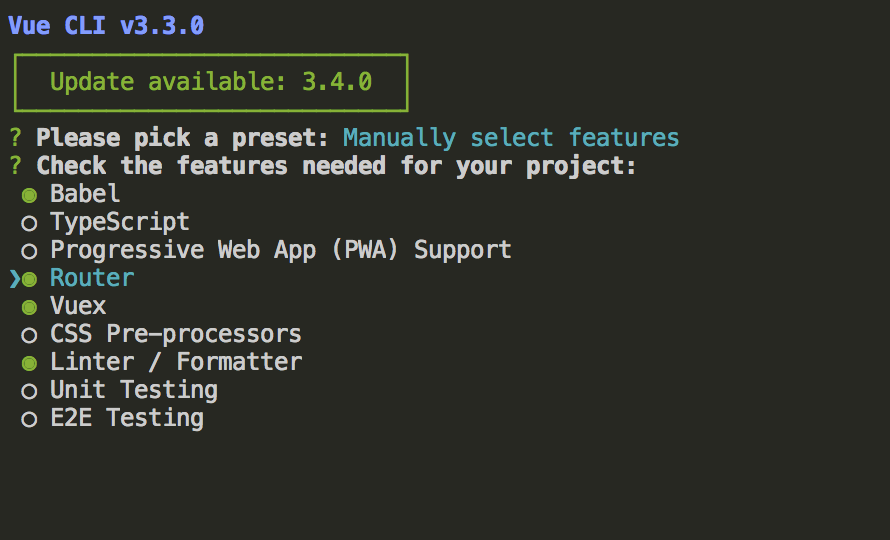
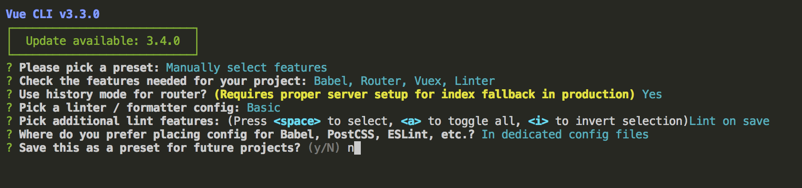
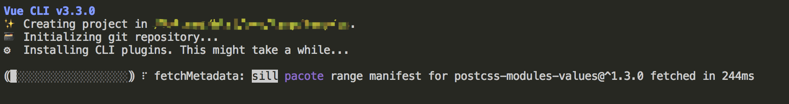

# vue-element-pro


## 简介
Vue-element-pro 是一个集成后台操作界面交互的基础前端框架  
基于[Vue.js](https://github.com/vuejs/vue) 和 [Element-ui](https://github.com/ElemeFE/element)。   

> 作为前后端分离的WEB项目的前端部分，需要额外制作供前端调用的后端API接口   

官方手册链接 

* Vue.js: [https://cn.vuejs.org/v2/guide/](https://cn.vuejs.org/v2/guide/)    
* Element-ui: [http://element-cn.eleme.io/#/zh-CN/component/installation](http://element-cn.eleme.io/#/zh-CN/component/installation)

## 项目安装说明

#### 安装依赖
```
npm install
```

#### 开发环境（本地运行 & 热更新）
```
npm run serve
```

#### 生产环境（打包压缩静态文件）
```
npm run build
```

## 项目构成步骤及说明

#### 由于开发环境需要Node.js，安装 node 和 npm
 > vue-cli 3 需要 Node.js 8.9 或更高版本。   
 推荐使用最新稳定版，目前最新 node v11.0.0 ; npm v6.7.0

### 安装 [Vue CLI 3](https://cli.vuejs.org/zh/guide/)  
Vue CLI 是一个基于 Vue.js 进行快速开发的完整系统，是搭建vue项目的脚手架工具
```
npm install -g @vue/cli		
```
			
### 使用Vue CLI 创建vue项目
```
/*  [web_framework] 填写你所需要创建的项目名 */

vue create [web_framework]      

```
#### 配置选项   
比默认增加了 vue-router 和 vuex 两个组件 [详见截图]


使用history模式
其余都是默认选项

最后可以选择是否保存这次配置，然后回车开始初始化项目


> 此时已经构建出一个vue项目，进入项目目录运行      
> ```
> npm run serve 
> ```
> 就可以看已经可以通过浏览器上访问这个本地项目了


#### 安装 vue-cli 的 element-ui 插件
```
vue add element
```
#### 分别安装要用到的插件
		
* axios：基于promise用于浏览器和node.js的http库，用于http请求   
```
npm install axios --save
```

* qs:	是一个增加了一些安全性的查询字符串解析和序列化字符串的库，用于url参数的解析   

```
npm install qs --save
```

* vue-ls: 封装localstorage浏览器本地储存

```
npm install vue-ls --save
```


## 项目目录结构

dist: 生产环境的编译打包压缩后的静态文件存放的目录，默认是'dist'，可以修改配置文件vue.config.js中的 outputDir来更换其他的目录

public: 这个目录是公共文件目录，在编译生产环境时，除了index.html会被改写（增加脚本和压缩代码），其他的文件都会被原样复制进dist目录

src: 所有的源代码所在目录

.eslintrc.js: eslint的配置

babel.config.js: babel的配置

package.json: node项目配置（项目说明、可执行脚本、依赖）

vue.config.js: vue项目配置，配置项详见 [vue.config.js 说明文档](https://cli.vuejs.org/zh/config/#vue-config-js)
